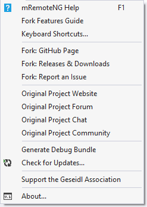
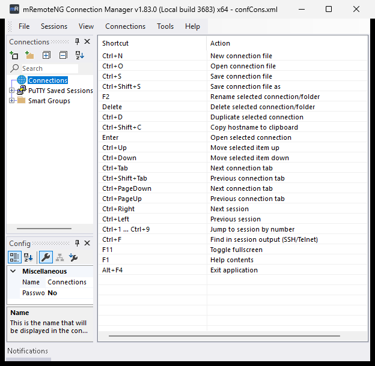
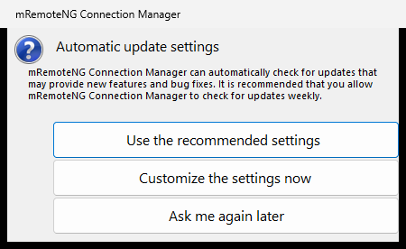

# Fork Features Guide

The in-app help (**Help > mRemoteNG Help**, or `F1`) opens the
[upstream manual](https://mremoteng.readthedocs.io/en/latest/). That manual describes the original
mRemoteNG and documents **none** of the additions made in this fork. This guide fills that gap: it
covers only what is different here, and assumes you already know how to use mRemoteNG itself.

Applies to **v1.83.0** and the current `nightly`. Screenshots were taken from a build of this
repository.

> **How this fork is maintained.** Fixes here are developed and verified by an automated pipeline —
> automated builds, an automated test suite, and a UI battery driven against the built app. The
> maintainers also run mRemoteNG daily. What that process *cannot* reproduce is your environment:
> your network, your servers, your locale. Where this guide states a limitation, it states it
> plainly rather than glossing over it. See
> [Crash reports and issue reporting](#9-crash-reports-and-issue-reporting).

---

## Contents

1. [Where your settings live (portable mode)](#1-where-your-settings-live-portable-mode)
2. [WebAuthn / FIDO2 redirection (RDP)](#2-webauthn--fido2-redirection-rdp)
3. [Entra ID authentication (RDP)](#3-entra-id-authentication-rdp)
4. [Vault / OpenBao SSH one-time passwords](#4-vault--openbao-ssh-one-time-passwords)
5. [Tabs that stay open after a disconnect](#5-tabs-that-stay-open-after-a-disconnect)
6. [Reconnecting last session's connections at startup](#6-reconnecting-last-sessions-connections-at-startup)
7. [Storing connections in SQL](#7-storing-connections-in-sql)
8. [Tools](#8-tools) — [Connection Tester](#81-connection-tester) · [Keyboard Shortcuts](#82-keyboard-shortcuts) · [Generate Debug Bundle](#83-generate-debug-bundle)
9. [Crash reports and issue reporting](#9-crash-reports-and-issue-reporting)
10. [Updates — GitHub only](#10-updates--github-only)

The **Help** menu is the entry point for most of this:



---

## 1. Where your settings live (portable mode)

**Every build of this fork is compiled as a portable edition.** That is a compile-time decision (the
`PORTABLE` constant, defined for every configuration CI actually builds — including the one the MSI
is packaged from). There is no setting, marker file, or command-line switch that turns it on or off.

In practice that means mRemoteNG looks for its configuration in a **`Settings\` folder next to
`mRemoteNG.exe`** first, and only falls back elsewhere if it cannot write there:

```
mRemoteNG.exe
Settings\
    confCons.xml                  connections
    mRemoteNG.settings            application settings (named after the exe)
    pnlLayout.xml                 window/dock layout
    Layouts\<name>.xml            named layouts (View > Save Layout...)
    extApps.xml                   external tools
    cmdSnippets.xml               command snippets
    Themes.xml, Themes\           themes
    LocalConnectionProperties.xml per-connection local state (incl. "was connected")
    quickConnectHistory.xml
    SqlConnectionsCache.xml
    confCons.xml.*.backup         rotating backups
```

### The writability fallback — why an installed copy behaves differently

Before using `Settings\`, the app writes a probe file next to the exe. If that fails, it silently
uses **`%APPDATA%\mRemoteNG Connection Manager\`** instead.

This is exactly what happens with the **MSI installation**: the program lands in `C:\Program Files`,
which a normal user cannot write to, so the profile goes to `%APPDATA%` and behaves like a
conventional installed application. Unpack the ZIP into a folder you own — a USB stick, `D:\Apps\`,
your user profile — and the same binaries keep everything in `Settings\`.

So if your settings appear to "reset" after moving the app, the first thing to check is whether the
new location is writable.

### Automatic migration into `Settings\`

Older portable layouts kept these files loose in the exe folder. On first run they are *moved* into
`Settings\`, one at a time, and **only when a file of that name does not already exist there** —
existing `Settings\` content always wins. Backups (`confCons.xml.*.backup`) and the `Themes` folder
move too. The migration is best-effort: if it fails, the app starts anyway.

### The "Configuration directory" option does not apply

**File > Options > Config** has a *Configuration directory* box. It is disabled in the portable
edition — which is every build — and the page says so:

> Portable edition always uses the application folder and does not support a custom configuration
> directory.

The *External apps file* box on the same page **does** work in both editions.

### Two practical notes

- **Upgrading:** copy your `Settings\` folder into the new version's folder before first launch.
  Nothing else carries state. To reset to factory defaults, close the app and delete `Settings\`.
- **The log file is not in `Settings\`.** In portable mode it sits directly beside the exe as
  `mRemoteNG Connection Manager.log` (and in `%LOCALAPPDATA%\mRemoteNG Connection Manager\` when the
  exe folder is read-only).

---

## 2. WebAuthn / FIDO2 redirection (RDP)

Forwards WebAuthn/FIDO2 passkey prompts from the remote session to a security key or platform
authenticator attached to *your* machine — so a passkey sign-in inside an RDP session can be
completed with the YubiKey in your laptop, or with Windows Hello on your side.

**Where:** select an RDP connection, then in the **Config** panel open the **Redirect** category.

| Property | Value | Default |
|---|---|---|
| **WebAuthn (FIDO2)** | Yes / No | **No** |

The description pane reads: *"Select whether WebAuthn / FIDO2 passkey requests on the remote machine
should be forwarded to authenticators attached to this computer."*

**How to enable it**

1. Select the connection in the connection tree.
2. In **Config**, scroll to **Redirect** (the property grid is grouped by category).
3. Set **WebAuthn (FIDO2)** to **Yes**.
4. Reconnect — redirection is applied when the session is established, not to a live session.

To make it the default for new connections, set the same property on the default connection (the
**Default Properties** button in the Config panel toolbar). To let a folder drive it, set
**Inherit WebAuthn (FIDO2)** on the child connection.

**Requirements and caveats**

- **RDP only.** The property is hidden for every other protocol.
- **Client-side minimum: Windows 10 20H1.** The setting is pushed through the RDP ActiveX control's
  extended-settings interface, which older clients do not expose.
- **Failure is silent by design.** If the installed RDP client does not know the property, the app
  swallows the error and connects without redirection. There is no Notifications entry for that
  case, so on an old client the setting simply appears to do nothing.
- The remote host must also support WebAuthn redirection; a host that predates the feature ignores
  it.

**Persistence:** stored in `confCons.xml`, in SQL (`RedirectWebAuthn` / `InheritRedirectWebAuthn`,
schema 3.4 and later), and in CSV export. It is written to exported `.rdp` files as
`redirectwebauthn:i:1` — but the `.rdp` **importer does not read that line back**, so a round-trip
through `.rdp` loses the setting.

---

## 3. Entra ID authentication (RDP)

Signs in to the remote machine with Microsoft Entra ID (formerly Azure AD) instead of classic Windows
credentials — for targets that are Entra-joined and expect a token rather than a domain password.

**Where:** select an RDP connection, then in the **Config** panel open the **Connection** category —
*not* Redirect.

| Property | Value | Default |
|---|---|---|
| **Entra ID Authentication** | Yes / No | **No** |

The description pane reads: *"Use Microsoft Entra ID (Azure AD) authentication when signing in to the
remote machine. Requires a compatible RDP client and a server enrolled with Entra ID."*

**How to enable it**

1. Select the connection.
2. In **Config > Connection**, set **Entra ID Authentication** to **Yes**.
3. Leave **Password** empty if you want the Entra sign-in dialog to appear; put the account you
   expect to be offered in **Username**.
4. Reconnect.

**Requirements and caveats**

- **RDP only**, and **client-side minimum Windows 10 22H2 / Windows 11**.
- As with WebAuthn, an older RDP client silently ignores the property.
- The remote machine must actually be enrolled with Entra ID. This setting does not join it, and it
  is unrelated to RD Gateway configuration.
- **`AzureAD\` usernames are handled for you.** If you type `AzureAD\someone@contoso.com` and leave
  **Domain** empty, the `AzureAD` prefix is moved into the domain field instead of being passed
  through as part of the user name.

**Persistence:** `confCons.xml`, SQL (`EnableRdsAadAuth` / `InheritEnableRdsAadAuth`, schema 3.4+),
CSV, and `.rdp` export (`enablerdsaadauth:i:1`, again not re-imported).

---

## 4. Vault / OpenBao SSH one-time passwords

Fetches a **single-use SSH password** from HashiCorp Vault or [OpenBao](https://openbao.org/) at
connect time instead of storing a password in the connection. The one-time password is requested for
one `(role, user, IP)` triple and is dead after use.

> **Read this first: the bundled PuTTY cannot do this.** SSH OTP mode needs a PuTTY build whose
> file-version **`InternalName` literally contains `PuTTYNG`**, because mRemoteNG has to inject an
> authenticator plugin through PuTTY's `-auth-plugin` option. The `PuTTYNG.exe` shipped with this
> fork reports `InternalName = PuTTY` (product version *Release 0.85 mRemoteNG*), so it is detected
> as plain PuTTY and embedded in **SetParent mode**. In that mode the connection is refused before it
> starts, and the **Notifications** panel shows:
>
> ```
> Cannot connect to VaultOpenbao ssh otp without using puttyng to inject authenticator plugin
> ```
>
> To use OTP mode, supply your own PuTTYNG-branded build and point the app at it with
> **File > Options > Advanced > Use custom PuTTY path**. The other Vault/OpenBao engines (key-value
> and LDAP) work fine with the bundled binary.

**Setting up a connection**

1. Select an **SSH** connection (SSH1 or SSH2 — OTP mode is not available on RDP).
2. In **Config > Connection**, set **External Credential Provider** to **Vault or Openbao**. The
   **Password** row disappears; the password now comes from the vault.
3. Set **Vault/Openbao Secret Engine** to **SSH engine OTP mode**.
4. Fill **Mount** with the mount path of your SSH secrets engine, and **Role** with the role
   configured there.
5. Fill **Username** with the account on the target host, and **Hostname/IP** as usual.

The available engines are **KeyValue (Username as Key)**, **LDAP dynamic role**, **LDAP static
role**, and **SSH engine OTP mode**. The Username row is hidden for the two LDAP engines.

**Signing in to the vault**

On the first vault-backed connection of the session, a dialog titled **Vault/Openbao API Login Data**
asks for:

- **Server URL** — remembered per user (registry, `HKCU\SOFTWARE\mRemoteVaultOpenbao`, value `URL`)
- **Access Token** — masked, kept in memory for the lifetime of the process only, never written to
  disk

If the URL does not answer you get a **Test connection failed** box and the connection is abandoned.
Cancelling the dialog reports `No credential provided`.

**What happens on connect**

The mount is verified to be an `ssh` backend; the hostname is resolved to an IPv4 address (Vault's
SSH OTP API takes an IP, not a name); the one-time password is requested; and it is handed to PuTTY
over a named pipe whose ACL grants access to your Windows account only. The helper executable
`vault-ssh-helper-plugin.exe` must sit next to `mRemoteNG.exe` — **it is not shipped with the
fork**, you provide it — and it has 10 seconds to complete the handshake.

**Messages you may see**

| Message | Cause |
|---|---|
| `Cannot connect to VaultOpenbao ssh otp without using puttyng to inject authenticator plugin` | The resolved PuTTY is not a PuTTYNG-branded build — see the box above |
| `Backend of type ssh does not match expected type N` | **Mount** points at a non-SSH engine |
| `Could not resolve address '<host>'` / `Failed to resolve address '<host>'` | The hostname has no IPv4 address |
| `Backend of type 3 is not supported` | SSH OTP mode selected on a connection that is not SSH (for example RDP) |
| `Invalid ping…` / `Invalid data request…` / `Mismatched data request from VaultOpenbao SSH OTP plugin` | The helper executable is missing, is the wrong one, or answered with data that does not match the connection |
| `Secret Server Interface Error: …` | Generic vault failure. The wording says "Secret Server" for Vault/OpenBao errors too — a known cosmetic bug, not a sign you picked the wrong provider |

**Persistence caveat.** **Mount**, **Role** and **Secret Engine** are stored **only in the XML
connections file**. They are not part of the SQL schema and not part of CSV export/import, so they do
**not** survive a SQL-backed configuration or a CSV round-trip. **External Credential Provider**
itself persists everywhere.

---

## 5. Tabs that stay open after a disconnect

**File > Options > Tabs & Panels > "Keep tabs open after disconnecting"** — **on by default.**

This is the behaviour originally requested in issue
[#61](https://github.com/robertpopa22/mRemoteNG/issues/61) and revisited in
[#139](https://github.com/robertpopa22/mRemoteNG/issues/139). When a session ends — you log off, the
server drops you, the SSH process exits — **the tab does not close. It becomes a reconnect
placeholder.**

**What you see with it on**

The tab keeps its title, and its content is replaced by a centred panel showing:

- the connection **name**, in bold
- `PROTOCOL   hostname:port`, plus the description if the connection has one
- a **Connect** button

**Three ways to reconnect from a placeholder**

1. Press the **Connect** button.
2. Select the placeholder tab and press **Enter**.
3. Right-click the tab and choose **Reconnect**.

All three reuse the same tab rather than opening a second one.

**Other things worth knowing**

- **Placeholder tabs do not count as open connections.** Closing the application will not warn about
  them, and they are not treated as live sessions elsewhere in the UI.
- **Closing a live tab takes two clicks.** Pressing the tab's **X** on a connected session closes the
  *protocol* and leaves the placeholder behind; press **X** again to close the tab itself. This is
  deliberate — it is the same code path as a server-side disconnect.
- Shutting the application down, or closing a whole panel, closes everything without leaving
  placeholders.
- If the tab's connection can no longer be identified, the placeholder shows *"Connection Event
  Closed"* with no Connect button.

**With the option off**, a finished session closes its tab immediately — the 1.77.3 behaviour. If it
was the panel's last tab, the panel closes too, subject to **Auto close panel after last tab
closes** on the same options page.

**Related, and often confused with it:** **File > Options > Advanced** has *"Display reconnection
dialog when disconnected from server (RDP & ICA only)"* and, enabled by it, *"Automatically try to
reconnect when disconnected from server (RDP & ICA only)"*. Those drive RDP's own reconnect attempt.
"Keep tabs open" only decides whether the tab survives afterwards.

---

## 6. Reconnecting last session's connections at startup

**File > Options > Startup/Exit > "Reconnect to previously opened sessions on startup"** — **off by
default.**

Two separate mechanisms restore a previous session, and **both** obey this one checkbox:

- **Connections marked as open** in the connection tree are reopened.
- **Tabs recorded in the saved dock layout** are reconnected.

The second one used to run unconditionally. It was gated in
[#120](https://github.com/robertpopa22/mRemoteNG/issues/120), because restoring a screenful of RDP
tabs at every launch — regardless of the setting — could hit the RDP control's creation timeout.

**The consequence people notice** (this is
[#172](https://github.com/robertpopa22/mRemoteNG/issues/172)): with the option **off**, your **panel
layout is still restored** — panels, docking, splitters — but **no tab reconnects**. The window looks
right and is empty. If you upgraded from an older build and your sessions stopped coming back, this
checkbox is what you are looking for.

**If it is on and sessions still do not return**, check **File > Options > Backup**: the "was
connected" flags are written when the connections file is saved. If saving is set to *Never*, those
flags go stale and there is nothing to restore.

Administrators can force this setting through Group Policy; when they do, the checkbox is greyed out
and a policy notice appears at the bottom of the page.

**The other Startup/Exit options** on the same page: allow only a single instance, start
minimized/full screen, disable refocus, and *Start with Windows* — which is not an application
setting at all but an entry in the `HKCU\...\Run` registry key, pointing at the current executable.
Move a portable copy and that entry will point at the old location.

---

## 7. Storing connections in SQL

Instead of `confCons.xml`, connections can live in a shared database so several workstations see the
same tree.

**Supported backends** (**File > Options > SQL Server**, *SQL type*):

| Choice | Notes |
|---|---|
| `MSSQL - developed by Microsoft` | SQL Server; also supports Entra ID auth modes |
| `MySQL - developed by Oracle` | also serves **MariaDB** — there is no separate MariaDB option |
| `ODBC - Open Database Connectivity` | treated as SQL Server for schema work |

**Setting it up**

1. **File > Options > SQL Server**.
2. Tick **Use SQL Server to load & save connections**.
3. Pick the *SQL type*, then fill the hostname and **Database** (default name: `mRemoteNG`).
4. Choose the auth type. For SQL Server the choices are *Windows Authentication*, *SQL Server
   Authentication*, and the Entra ID variants (*MFA*, *Password*, *Integrated*, *Service Principal*,
   *Managed Identity*, *Default*). Username and password fields appear or disappear to match.
5. Press **Test connection**.
6. **OK** or **Apply** — the connection tree reloads from the database.

**What Test connection does.** It uses whatever is typed in the boxes, not the saved settings, and
reports one of: *Connection successful*; a server-not-reachable error; a credentials-rejected error;
or an unknown-database error. Failures now include the database provider's own message underneath the
classification, because "server not accessible" alone does not distinguish a wrong instance name from
a blocked port or a timeout. Passwords are masked out of anything shown.

**Automatic database creation.** If the database does not exist, a **Database Not Found** box offers
to create it. Accepting runs `CREATE DATABASE` (the name is validated first — letters, digits,
underscore and hyphen only) and re-tests. It creates the **database only**; the tables are created on
the first real connect.

**Schema upgrades happen automatically and silently.** The current schema is **version 3.6**, stamped
in `tblRoot.ConfVersion`. On connect, missing columns are added and the version chain is walked from
whatever the database has (as far back as 2.2) up to 3.6, in one pass, with no prompt. Recent steps:

| Step | Adds |
|---|---|
| 3.3 → **3.4** | `RedirectWebAuthn`, `EnableRdsAadAuth` and their two `Inherit…` columns — the WebAuthn/Entra step |
| 3.4 → **3.5** | `UseRedirectionServerName` (+ inherit) |
| 3.5 → **3.6** | `Notes` (+ inherit) |

That last one is worth calling out: **before schema 3.6 the SQL backend had no Notes column at all**,
so notes typed against a SQL-backed profile were discarded on save without any error. Upgrading fixes
the schema; notes lost before the upgrade are gone.

If the schema cannot be brought up to date, loading warns (*"The database version … is not compatible
with this version of …"*) while **saving refuses outright** rather than writing a partial tree.

**Two data-loss guards you may run into**

- If `tblCons` exists but `tblRoot` is missing, the load **aborts with an error** instead of
  recreating the schema — recreating would drop your connections table. Restore `tblRoot` or rebuild
  the schema deliberately.
- If the in-memory tree is empty but the database has rows, the save is **refused**. This is what
  stops a failed load from truncating a shared database.

**Read only.** The *Read only* checkbox blocks saving, external-tools writes, tree editing, the
context-menu commands and drag & drop. It is a **client-side flag, not a database permission** — for
an actual guarantee, restrict the SQL login as well.

**Also on this page:** *Show picker on startup* (choose a database profile at launch), a *Reload
interval* in seconds, and — behind **Advanced >>** — saved connection profiles (load/save/delete) and
the schema selector.

**Not stored in SQL:** the Vault/OpenBao **Mount**, **Role** and **Secret Engine** fields
([section 4](#4-vault--openbao-ssh-one-time-passwords)), and the per-connection "was connected" flag,
which is kept locally in `LocalConnectionProperties.xml` instead.

---

## 8. Tools

### 8.1 Connection Tester

**Tools > Connection Tester** opens a panel that walks the whole connection tree and reports which
hosts answer.

| Column | Meaning |
|---|---|
| **Name** | connection name |
| **Hostname/IP** | address probed |
| **Port** | the port actually probed — if the connection's port is 0, the protocol default is used |
| **Status** | `Pending`, then `Open` or `Closed` |

Press **Start Test** to run; the button becomes **Stop Test** while a run is in progress, and a
progress bar tracks completion. Column headers sort.

What it does and does not do:

- It is a **plain TCP connect probe**. It does not log in, does not speak the protocol, and does not
  ping. `Open` means the port accepted a TCP connection — nothing about credentials or service
  health.
- **Every connection in the tree is tested**, not the selection. Folders are skipped, and so is any
  connection with an empty hostname.
- **The timeout is 3 seconds per connection and is not configurable**, and connections are probed
  **one at a time**. A tree full of unreachable hosts therefore takes roughly 3 seconds each.
- A timeout, a DNS failure and a refused connection all show as **`Closed`** — the window does not
  distinguish them.
- **There is no export.** Results are view-only: no copy, no CSV, no save.

### 8.2 Keyboard Shortcuts

**Help > Keyboard Shortcuts...** opens a read-only reference card of the application's shortcuts.



It is a reference, not an editor: shortcuts cannot be rebound, and nothing here is written back to
settings. The list is maintained in source rather than derived from the live menus, so treat it as
documentation that can drift — `Ctrl+F` in particular is listed, but *Find in Session* is currently a
menu label rather than a bound accelerator, so use **Tools > Find in Session** if the key does
nothing.

### 8.3 Generate Debug Bundle

**Help > Generate Debug Bundle** collects diagnostics into a single ZIP to attach to a bug report.

1. A **Save As** dialog appears, pre-filled with `mRemoteNG_Debug_YYYYMMDD_HHMMSS.zip`. **You choose
   where it goes** — there is no fixed output folder.
2. On success you get a **Debug Bundle** box saying *"Debug bundle created successfully!"*. It does
   not repeat the path, so note where you saved it.

The archive contains exactly three entries:

| Entry | Contents |
|---|---|
| `SystemInfo.txt` | app version, OS version, 32/64-bit, CLR version, current culture, portable-edition flag |
| `mRemoteNG.log` | the application log, copied **byte-for-byte** |
| `confCons.xml` | your connections file, with password attributes replaced by `***REMOVED***` |

Nothing else is included — no application settings, no external tools, no themes, no crash dumps. If
your connections live in a **SQL database**, the database is *not* included: the bundle falls back to
whatever local `confCons.xml` exists, which may be stale or absent (you then get a
`confCons.xml.missing.txt` note instead).

> **Check the bundle before you send it.** The redaction is a single pattern that blanks every XML
> attribute whose name ends in `Password` — so `Password`, `ContainerPassword`, `RDGatewayPassword`
> and `VNCProxyPassword` are removed (they are stored encrypted anyway). **Everything else is left
> intact**, and two things there matter:
>
> - **`RDGatewayAccessToken` is stored in plain text and is *not* redacted.** If you use RD Gateway
>   access tokens, a usable secret ships in the bundle.
> - **The log is copied with no scrubbing at all**, and routinely contains hostnames, user names and
>   connection names.
>
> Hostnames, user names, domains, ports, descriptions, user fields and pre/post-connection commands
> are preserved throughout. Open the ZIP and review it before attaching it to a public issue.

---

## 9. Crash reports and issue reporting

When an unhandled exception occurs, mRemoteNG shows an **mRemoteNG Unhandled Exception** window with
the exception message, the stack trace, and a short environment block (OS version, application
version, Portable or MSI, and the command line). If the exception is fatal the window says so and its
close button exits the application.

**Nothing is sent anywhere unless you press *Submit Error*.** There is no background uploader. You
can read the entire report first — **Copy All** puts exactly what would be submitted on the
clipboard.

**What gets submitted, if you choose to submit**

- the exception type and its message
- the stack trace (trimmed to 4000 characters)
- OS version, application version, Portable/MSI, and the command-line arguments
- a note that the report is auto-generated, and a pointer to the pinned issue
  [#167](https://github.com/robertpopa22/mRemoteNG/issues/167)

Your connections file, settings, log file and credentials are **not** attached.

> **One caution.** The exception message and the command line are passed through **unmodified**. If
> you launch mRemoteNG with a custom connections-file path, that path — and any user or share name in
> it — appears in the report, and a file-access error message can contain a full path. Read the
> dialog before pressing Submit; what it shows is exactly what is sent.

**Where the report goes.** Official builds post directly to this fork's issue tracker through the
GitHub API, labelled `bug`, `crash-report`, `auto-submitted`, and you get the issue URL in a message
box. Because the API token belongs to the maintainer, **the issue is filed under the maintainer's
account and you are anonymous on it** — if you want to be reachable for follow-up questions, add a
comment to the issue yourself. Builds without that token (local builds, builds from source) instead
open a **pre-filled issue form in your browser**, which you submit yourself under your own account.

**Opting out.** There is no setting for this. The opt-out is not pressing the button.

**Why this matters more here than in most projects.** Fixes in this fork are produced and verified by
an automated pipeline: automated tests, a UI battery, adversarial review between independent models.
That pipeline cannot reproduce your network, your server or your locale. When a fix for your crash
ships in a nightly, **your retest is the verification** — nothing else in the process can stand in
for it. Anything you add to the report (what you were doing, a screenshot, a hunch) is real debugging
help. The full contract is in the pinned issue
[#167](https://github.com/robertpopa22/mRemoteNG/issues/167).

---

## 10. Updates — GitHub only

This fork distributes exclusively through GitHub Releases. The upstream Stable/Preview/Nightly update
channels — text manifests hosted on `mremoteng.org` — have been removed entirely. **There is no
channel setting anywhere in the app**, and nothing to choose between.

**Two live releases**

| Release | Tag | Made when | Offered by the in-app check? |
|---|---|---|---|
| **Stable** | `vX.Y.Z` | a version tag is pushed | **Yes** — this is what the updater reports |
| **Nightly** | `nightly` | every push to `main`; the previous one is deleted and replaced | **No** |

The in-app check queries a single endpoint —
`https://api.github.com/repos/robertpopa22/mRemoteNG/releases/latest` — and GitHub's *latest*
excludes prereleases. The nightly is published as a prerelease, so **the updater never offers a
nightly**. To try one, use **Help > Fork: Releases & Downloads**.

**Checking manually**

**Help > Check for Updates...** opens a panel and starts checking immediately — you do not have to
press anything the first time. The status line shows one of:

- **No update available** (green) — you are on the latest stable, or newer than it
- **mRemoteNG available** (orange) — a newer stable exists; the changelog and a **Download** button
  appear
- **Check failed!** (orange) — the request did not succeed

**Download opens the GitHub release page in your browser.** It does not fetch, verify or install
anything: there is no in-app download, no signature check, no auto-install and no restart prompt.
Upgrading is a manual step you perform yourself — and for a portable install that means downloading,
unpacking, and copying your `Settings\` folder across
(see [section 1](#1-where-your-settings-live-portable-mode)).

**Automatic checks**

On first launch you are asked once how this should be handled:



- **Use the recommended settings** — enable the startup check (every 14 days if no interval was set)
- **Customize the settings now** — opens **File > Options > Updates**
- **Ask me again later** — the prompt returns on the next launch

Under **File > Options > Updates** you can toggle *Check for updates at startup* and pick **Daily /
Weekly / Monthly** (choosing *Never* turns the startup check off). Out of the box the interval is 14
days, which the dropdown displays as *Every 14 days*. The same page holds proxy settings with a
**Test Proxy** button.

Two details that surprise people:

- **A startup check never pops a window.** If an update is found at startup the app only records the
  fact; you see it when you open **Help > Check for Updates...** yourself.
- **The Windows system proxy is deliberately bypassed** unless you configure a proxy on this page.

Administrators can disable all of this by policy, in which case the Updates page is greyed out and the
**Check for Updates...** menu item is disabled.

---

## Maintained by

<a href="https://geseidl.ro/servicii-it"></a>

This fork is maintained by [Geseidl IT Solutions](https://geseidl.ro/servicii-it), part of
[Geseidl Consulting Group](https://geseidl.ro).
